# SPIRAL Workflow Diagram

> Tip: GitHub renders Mermaid natively. For a local preview use [Mermaid Live Editor](https://mermaid.live) or the **Markdown Preview Mermaid Support** VS Code extension.

```mermaid
flowchart TD
    %% ── Style definitions ──────────────────────────────────────────────────
    classDef startup  fill:#22c55e,stroke:#16a34a,color:#fff,font-weight:bold
    classDef pipeline fill:#3b82f6,stroke:#2563eb,color:#fff,font-weight:bold
    classDef impl     fill:#f97316,stroke:#ea580c,color:#fff,font-weight:bold
    classDef validate fill:#8b5cf6,stroke:#7c3aed,color:#fff,font-weight:bold
    classDef decision fill:#eab308,stroke:#ca8a04,color:#000,font-weight:bold
    classDef file     fill:#f1f5f9,stroke:#94a3b8,color:#374151,font-size:11px
    classDef done     fill:#10b981,stroke:#059669,color:#fff,font-weight:bold
    classDef ralph    fill:#ec4899,stroke:#db2777,color:#fff,font-weight:bold
    classDef source   fill:#e0f2fe,stroke:#0284c7,color:#0c4a6e,font-size:11px

    %% ── STARTUP ─────────────────────────────────────────────────────────────
    subgraph SU["🚀 STARTUP  (runs once — skipped on resume or --gate proceed)"]
        direction TB
        S0A["0-A Constitution\nCreate / review non-negotiable rules\nOutputs: constitution.md"]
        S0B["0-B Focus\nSet session theme\nExports: SPIRAL_FOCUS"]
        S0C["0-C Clarify\n3 targeted questions to lock scope"]
        S0D["0-D Story Preparation\nSource 1: type free-text → prd.json\nSource 2: pick number → queue"]
        S0E["0-E Options\nTime limit · gate mode\nExports: TIME_LIMIT_MINS"]
        S0A --> S0B --> S0C --> S0D --> S0E
    end

    S0D -->|"seed (Source 1)\ndirect write"| PRD[(prd.json)]
    S0D -->|"ai-example (Source 2)\nqueued"| QUEUE[(_ai_example_queue.json)]
    S0E --> PhA

    %% ── MAIN LOOP ────────────────────────────────────────────────────────────
    subgraph LP["🔄 MAIN LOOP  (per iteration — phases A → R+T → S → M → G → I → V → C)"]
        direction TB

        subgraph PhA_box["Phase A — AI Suggestions"]
            PhA["Phase A\nai_suggest.py  ·  generate_test_stories.py"]
        end

        subgraph PhRT_box["Phase R + T — parallel"]
            PhR["Phase R: Research\nGemini pre-fetch → Claude agent\nSKIP if --skip-research · over-capacity · cache-hit"]
            PhT["Phase T: Test Synthesis\nsynthesize_tests.py\nSKIP on memory pressure"]
        end

        subgraph PhS_box["Phase S — Story Validate"]
            PhS["Phase S: Story Validate\nvalidate_stories.py\nConstitution ✓ + Goal alignment ✓\n(test-fix & test-story: constitution only)"]
        end

        subgraph PhM_box["Phase M — Merge"]
            PhM["Phase M: Merge\nmerge_stories.py\nPriority: test-fix/test-story › research › ai-example\nDedup: 60% word-overlap heuristic"]
        end

        PhG{"Phase G\nGate\n--gate proceed\n→ auto-yes"}

        subgraph PhI_box["Phase I — Implement"]
            PhI["Phase I: Implement\nRalph inner loop\nDecompose › Execute › Test › Commit/Revert\nRetry: haiku → sonnet → opus"]
        end

        subgraph PhV_box["Phase V — Validate"]
            PhV["Phase V: Validate\nSPIRAL_VALIDATE_CMD (integration)\n+ Persistent suites: smoke · regression\n  security · performance"]
        end

        PhC{"Phase C\nCheck Done\nall passes:true\n+ 0 test failures?"}
    end

    %% ── DATA FLOW: Phase A inputs/outputs ───────────────────────────────────
    QUEUE -->|"consumed + cleared"| PhA
    PRD -->|"gap analysis"| PhA
    PhA -->|"_ai_suggest_output.json\n(Source 2 ai-example)"| PhS
    PhA -->|"_test_story_candidates.json\n(Source 5 test-story)"| PhS

    %% ── DATA FLOW: Phase R/T inputs/outputs ─────────────────────────────────
    PhA --> PhR
    PhA --> PhT
    PhR -->|"_research_output.json\n(Source 3 research)"| PhS
    PhT -->|"_test_stories_output.json\n(Source 4 test-fix)"| PhS

    %% ── DATA FLOW: Phase S ───────────────────────────────────────────────────
    PhS -->|"_validated_stories.json\n(accepted)"| PhM
    PhS -.->|"_story_rejected.json\n(log only)"| REJECTED[(_story_rejected.json)]

    %% ── DATA FLOW: Phase M ───────────────────────────────────────────────────
    OVERFLOW[(_research_overflow.json\ncap-blocked candidates)] -->|"previous iteration"| PhM
    PhM -->|"patches prd.json\n+ assigns IDs"| PRD
    PhM -->|"overflow →\nnext iteration"| OVERFLOW

    %% ── DATA FLOW: Gate ─────────────────────────────────────────────────────
    PhM --> PhG
    PhG -->|"proceed"| PhI
    PhG -->|"skip I"| PhV
    PhG -->|"quit"| EXIT([❌ Exit])

    %% ── DATA FLOW: Phase I ───────────────────────────────────────────────────
    PhI -->|"passes:true\n_passedCommit SHA"| PRD
    PhI -->|"results"| RESULTS[(results.tsv)]
    PhI --> PhV

    %% ── DATA FLOW: Phase V ───────────────────────────────────────────────────
    PhV -->|"test reports"| REPORTS[(test-reports/)]
    PhV -->|"suite results"| SUITES[(.spiral/test-suites/\nsmoke · regression\nsecurity · performance)]
    REPORTS --> PhC
    PRD --> PhC

    %% ── CHECK DONE decision ─────────────────────────────────────────────────
    PhC -->|"✅ ALL DONE"| DONE([🎉 SPIRAL COMPLETE])
    PhC -->|"⏳ pending stories\nor test failures"| PhA

    %% ── RALPH INNER LOOP (Phase I detail) ───────────────────────────────────
    subgraph RL["⚙️ RALPH INNER LOOP (inside Phase I)"]
        direction LR
        R1["Pick next story\n(priority + deps)"]
        R2["git branch\n+ worktree"]
        R3["Claude implements\n(haiku / sonnet / opus)"]
        R4{"Tests\npass?"}
        R5["Commit\npasses: true"]
        R6["Revert\nescalate model"]
        R7{{"Attempt\n≥ 3?"}}
        R8["Mark _skipped\n(try next story)"]
        R1 --> R2 --> R3 --> R4
        R4 -->|"✅ yes"| R5
        R4 -->|"❌ no"| R6
        R6 --> R7
        R7 -->|"no → retry"| R3
        R7 -->|"yes → skip"| R8
        R8 --> R1
        R5 --> R1
    end
    PhI -.->|"orchestrates"| R1

    %% ── STORY SOURCES LEGEND ─────────────────────────────────────────────────
    subgraph SRC["📌 5 Story Sources"]
        direction LR
        SRC1["① seed\nuser typed in 0-D\n→ prd.json direct"]
        SRC2["② ai-example\nnumbered pick in 0-D\n→ Phase A each iter"]
        SRC3["③ research\nClaude agent Phase R\n→ S → M → prd.json"]
        SRC4["④ test-fix\nfailing test Phase T\n→ S → M → prd.json"]
        SRC5["⑤ test-story\nfrom passed stories Phase A\n→ S → M → prd.json"]
    end

    %% ── Apply styles ────────────────────────────────────────────────────────
    class S0A,S0B,S0C,S0D,S0E startup
    class PhA,PhR,PhT,PhS,PhM pipeline
    class PhI impl
    class PhV validate
    class PhG,PhC decision
    class PRD,QUEUE,OVERFLOW,REJECTED,RESULTS,REPORTS,SUITES file
    class DONE,EXIT done
    class R1,R2,R3,R4,R5,R6,R7,R8 ralph
    class SRC1,SRC2,SRC3,SRC4,SRC5 source
```

---

## Phase Reference

| Phase | Name | Key Script | Inputs | Outputs | Skip Condition |
|-------|------|-----------|--------|---------|----------------|
| 0-A…0-E | Clarify (startup) | `lib/phases/phase_0_clarify.sh` | User input | `_clarify_output.json`, `SPIRAL_FOCUS`, `_ai_example_queue.json` | `--gate proceed` or `_phase_0_done` marker |
| A | AI Suggestions | `lib/ai_suggest.py` + `lib/generate_test_stories.py` | `prd.json`, `_ai_example_queue.json` | `_ai_suggest_output.json`, `_test_story_candidates.json` | — |
| R | Research | Claude agent + Gemini | `SPIRAL_RESEARCH_PROMPT`, `prd.json` | `_research_output.json` | `--skip-research`, over-capacity, cache hit |
| T | Test Synthesis | `lib/synthesize_tests.py` | `test-reports/` | `_test_stories_output.json` | Memory pressure |
| S | Story Validate | `lib/validate_stories.py` | All candidate files, `prd.json` goals | `_validated_stories.json`, `_story_rejected.json` | — |
| M | Merge | `lib/merge_stories.py` | `_validated_stories.json`, overflow | `prd.json` (patched), `_research_overflow.json` | — |
| G | Gate | (interactive) | — | User decision | `--gate proceed` |
| I | Implement | `ralph/ralph.sh` | `prd.json` | `prd.json` (passes:true), `results.tsv` | — |
| V | Validate | `lib/test_suite_manager.py` + `SPIRAL_VALIDATE_CMD` | Test suite + prd.json | `test-reports/`, `.spiral/test-suites/` | — |
| C | Check Done | `lib/check_done.py` | `prd.json`, `test-reports/` | Exit 0 (done) or Exit 1 (loop) | — |

## Key Config Variables

| Variable | Default | Purpose |
|----------|---------|---------|
| `SPIRAL_FOCUS` | (empty) | Session theme — injected into Phase R prompt |
| `SPIRAL_VALIDATE_CMD` | `python3 tests/run_tests.py` | Phase V integration test command |
| `SPIRAL_MAX_PENDING` | 0 (unlimited) | Hard cap on pending stories |
| `SPIRAL_MAX_AI_SUGGEST` | 5 | Phase A: max gap-analysis suggestions per iteration |
| `SPIRAL_RESEARCH_MODEL` | sonnet | Claude model for Phase R |
| `SPIRAL_RALPH_WORKERS` | 1 | Parallel workers for Phase I |
| `SPIRAL_RESEARCH_CACHE_TTL_HOURS` | 0 (disabled) | Cache Phase R URL responses |
| `TIME_LIMIT_MINS` | 0 (unlimited) | Stop loop after N minutes (set in Phase 0-E) |
| `SPIRAL_SPECKIT_CONSTITUTION` | (empty) | Constitution file used in Phase S |
